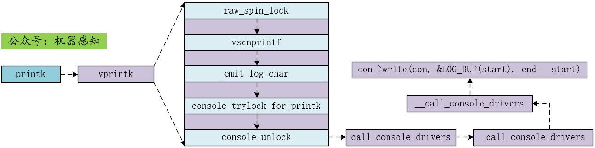

#### 1. 概述

printk 用于在终端上打印内核想要输出的信息，平常我们较多使用的打印函数是 printf，两者名字虽然只有最后一个字母不同，且都是为了在终端上显示信息，但是它们的应用场景并不相同。printk 是 linux 内核用来打印消息的，而 printf 则是用户态模式下打印消息用的，不过最终 printf 会通过系统调用的方式使用 printk 进行消息的显示。printk 的整体代码流程如下：

<div align="center"> 
 
</div>

#### 2. 代码分析

首先是 printk 函数，因为 printk 函数是支持不定参数的，所以第一步就是先解析参数，之后就是调用 vprintk 函数了。

```c
asmlinkage int printk(const char *fmt, ...)
{
	... 省略 ...
	va_start(args, fmt);
	r = vprintk(fmt, args);
	va_end(args);

	return r;
}
```

对于 vprintk 函数，其主要步骤如上图所示，首先是调用 vscnprintf 格式化字符串，并放入到 printk_buf 中，接下来就是再根据 log level 以及是否需要增加时间前缀等信息再次格式化字符串，并将最后的字符串从 printk_buf 复制到 log_buff 中，最后就是将 log_buff 中的字符串输出到终端上，实际执行输出操作的是在 console_unlock() 中进行的。

```c
asmlinkage int vprintk(const char *fmt, va_list args)
{
    ... 简略版 ...
    raw_spin_lock(&logbuf_lock);
    /* 格式化到 printk_buf */
	printed_len += vscnprintf(printk_buf + printed_len,
				  sizeof(printk_buf) - printed_len, fmt, args);
    /* 格式化到 log_buf */
    for (; *p; p++) {
		if (new_text_line) {
			new_text_line = 0;
             ...
        }
        
        emit_log_char(*p);
		if (*p == '\n')
			new_text_line = 1;
    }
    /* 将 log_buf 中的字符串输出到终端上*/
    if (console_trylock_for_printk(this_cpu))
		console_unlock();
    
    return printed_len;
}
```

在 console_unlock 中，首先根据 con_start 和 log_end 来检查是否有需要在终端上打印的消息，如果有则开始使用 call_console_drivers 调用 console 关联的底层驱动程序进行最终的消息打印操作。

```c
void console_unlock(void)
{
	...
again:
	for ( ; ; ) {
		raw_spin_lock_irqsave(&logbuf_lock, flags);
		wake_klogd |= log_start - log_end;
		if (con_start == log_end)
			break;
		_con_start = con_start;
		_log_end = log_end;
		con_start = log_end;
		raw_spin_unlock(&logbuf_lock);
		stop_critical_timings();
		call_console_drivers(_con_start, _log_end);
		start_critical_timings();
		local_irq_restore(flags);
	}
	console_locked = 0;
	...
}
```

而 call_console_drivers 函数又调用了 _call_console_drivers，进一步调用 __call_console_drivers，最终调用不同 console 关联的写操作 con->write(con, &LOG_BUF(start), end - start) 实现打印操作。

```c
static void __call_console_drivers(unsigned start, unsigned end)
{
	struct console *con;

	for_each_console(con) {
		if (exclusive_console && con != exclusive_console)
			continue;
		if ((con->flags & CON_ENABLED) && con->write &&
				(cpu_online(smp_processor_id()) ||
				(con->flags & CON_ANYTIME)))
			con->write(con, &LOG_BUF(start), end - start);
	}
}
```

#### 3. 总结

- printk 函数第一步是解析参数列表，然后对带有参数的字符串进行格式化，并放入到 printk_buf 中，最后再根据 log level 以及是否需要加时间前缀等配置再次格式化字符串，并放入到 log_buf 中；

- 当 log_buf 中有需要打印的信息时，则调用 console 所关联的驱动程序完成最终的打印操作。
- 在 __call_console_drivers 中调用 console 所关联的驱动时会先判断 con->write 是否存在，如果 con->write 不存在，则不会在终端中有信息输出，即直接忽略这次打印，然而在 linux 内核启动初期就已经开始调用 printk 函数了，而此时还并没注册 console 设备，就更不可能存在 con->write 了，那这个阶段调用 printk 输出的信息岂不是都丢了？然而事实并不是这样子的，欲知后事如何，且听下回分解。